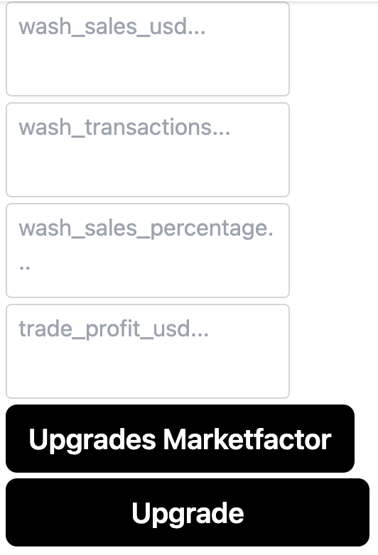

# NFTMarketplace
NFTMarket-Competition Code File<br>
1. Open the folder with VS Code and enter the following command to configure the environment:<br>
```npm install```<br>
2. Open the terminal and run the following command to run the back-end:<br>
```node server.js```<br>
3. Enter the following commands in the terminal to build and run the program:<br>
```npm run build```<br>
```npm start ```<br>
4. Enter the following address in the browser containing the MetaMask plug-in to open the program:<br>
```http://localhost:3005```<br>
5. Figure 1. Click "Create" to enter the market factor update page:<br>
<br>
6. As shown in Figure 2, click "Get Marketfactor" to get 5 market factors in this NFT market:<br>
```supply,total_transactions,unique_buyers,unique_sellers,total_price_usd```<br>
<br>
7. As shown in Figure 3, input 4 simulated residual market factors:<br>
```wash_sales_usd,wash_transactions,wash_sales_percentage,trade_profit_usd```<br>
<br>
Click again on ```Upgrades```to update all market factors to the database<br>

# The test Wallet is in the file wallet:<br>
There are 1.8 Sepolia test coins built into the wallet, and due to limited resources, all prices in the test are 0.01 times the automatic pricing of the model.<br>
The following faucets can receive free Sepolia test coins:<br>
```https://www.infura.io/faucet/sepolia```<br>
```https://sepoliafaucet.com/```<br>
